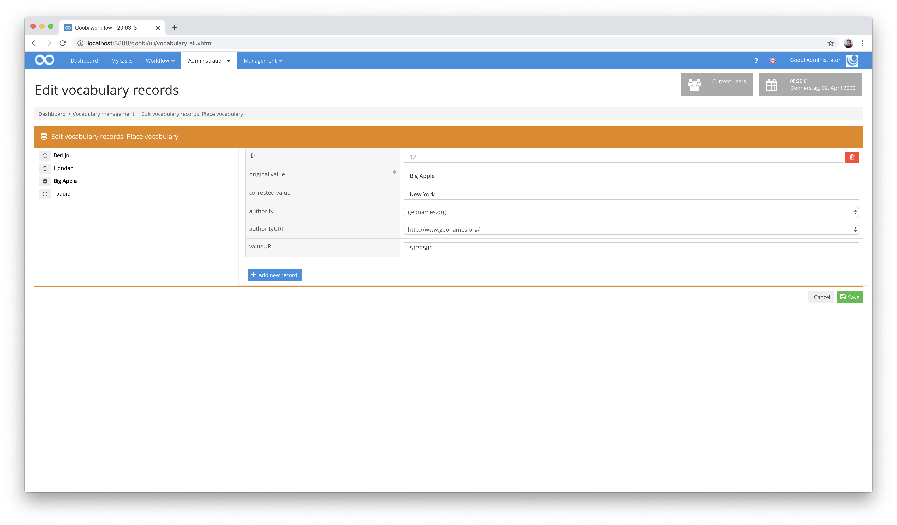
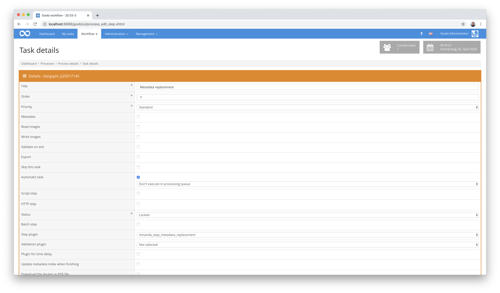
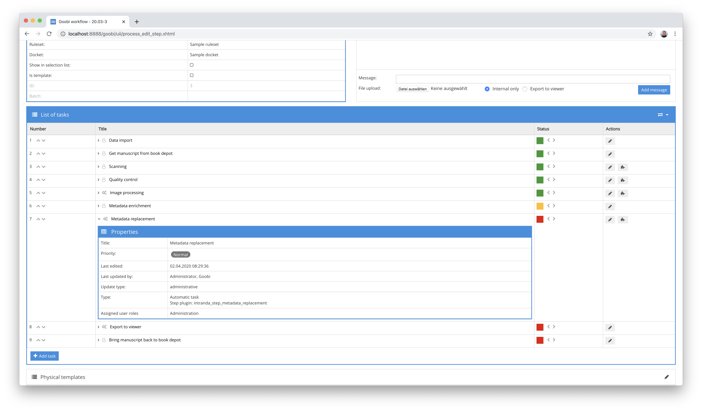

## Einführung
Dieses Plugin erlaubt eine automatische Anreicherung von Metadaten innerhalb der METS-Dateien von Goobi workflow mit Inhalten aus innerhalb von Goobi verwalteten kontrollierten Vokabularen.


## Installation
Zur Nutzung des Plugins muss dieses an den folgenden Ort kopiert werden:

```bash
/opt/digiverso/goobi/plugins/step/plugin_intranda_step_metadata_replacement-base.jar
```

Die Konfiguration des Plugins findet innerhalb dessen Konfigurationsdatei `intranda_step_metadata_replacement.xml` statt. Diese wird unter folgendem Pfad erwartet:

```bash
/opt/digiverso/goobi/config/intranda_step_metadata_replacement.xml
```

## Überblick und Funktionsweise
Dieses Plugin kann sehr granular konfiguriert werden und arbeitet intensiv mit den innerhalb von Goobi verwalteten Vokabularen zusammen. Anhand des des folgenden Beispiels läßt sich die Funktionsweise gut aufzeigen:

Innerhalb der Metadaten liegen wenige Informationen über Erscheinungsorte vor. Eine uneinheitliche Schreibweisen der Ortsnamen und fehlende Verlinkungen zu einer Normdatenbank lassen Informationen vermissen und erlauben keine Nutzung von Linked-Open-Data. Beispielhaft könnten die Metadaten für den Erscheinungsort `London` folgendermaßen aussehen:


Innerhalb eines Vokabulars können Orte mit zugehörigen Daten gepflegt werden. Hier kann unter anderem angegeben werden, welche Ortsnamen durch welche Ortsnamen ersetzt werden sollen. Außerdem kann hier definiert werden, welche Verlinkung zu einer Normdatenbank wie `GeoNames` oder `VIAF` erzeugt werden soll.



Innerhalb des Workflows von Goobi können die vorliegenden Metadaten innerhalb der METS-Datei eines Goobi-Vorgangs basierend auf einer Konfiguration wie oben angegeben automatisiert mit Daten aus dem Vokabular angereichert werden. Im Falle des Erscheinungsorts London kann so beispielsweise die gewünschte Schreibweise zusammen mit den Normdaten aus `GeoNames` in ein zusätzliches Feld überführt werden.


Die konstante Pflege des Vokabulars und die Integrierbarkeit in einen Workflow auch an mehreren Stellen innerhalb von Aufgaben erlaubt, dass die Inhalte auch künftig aktualisiert und veröffentlicht werden können.


## Konfiguration 
Die Konfiguration des Plugins ist folgendermaßen aufgebaut:

```xml
<config_plugin>
    <config>
        <project>*</project>
        <step>*</step>
        <entry>

            <!-- from which field inside of the METS file shall the content be used -->
            <fieldFrom>originalAccessLocations</fieldFrom>

            <!-- into which fields in the METS shall the new content be written -->
            <fieldTo>AccessLocations</fieldTo>

            <!-- if the fieldTo is named inside of the vocabulary entry itself: in
                which vocabulary field of the entry is the METS metadata name defined to
                be used? Please notice: if the entry cannot be found (as fieldFrom is not
                found there) and that's why no fieldToDynamic can be read from the entry
                the value of element fieldTo defined will be used to simply copy the original
                metadata unchanged -->
            <fieldToDynamic>type</fieldToDynamic>

            <!-- what is the name of the vocabulary to use -->
            <vocabulary>Subject terms</vocabulary>

            <!-- the content in which vocabulary field has to be the same as in fieldFrom -->
            <contentSearch>original value</contentSearch>

            <!-- the content in which vocabulary field shall be taken to write it
                into fieldTo -->
            <contentReplace>corrected value</contentReplace>

            <!-- the content in which vocabulary fields shall be taken to fill the
                authority information for the replaced record -->
            <contentAuthority>authority</contentAuthority>
            <contentAuthorityUri>authorityURI</contentAuthorityUri>
            <contentAuthorityValueUri>valueURI</contentAuthorityValueUri>

            <!-- if the content for fieldFrom cannot be found in the vocabulary to be replaced,
                shall the original value be duplicated then? -->
            <duplicateIfMissing>false</duplicateIfMissing>

            <!-- if the same value in fieldTo exists more than once remove the duplicates -->
            <removeDuplicatedFieldTo>false</removeDuplicatedFieldTo>
        
        </entry>
    </config>
</config_plugin>
```

Die Parameter innerhalb dieser Konfigurationsdatei haben folgende Bedeutungen:

| Wert | Beschreibung |
| :--- | :--- |
| `project` | Dieser Parameter legt fest, für welches Projekt der aktuelle Block `<config>` gelten soll. Verwendet wird hierbei der Name des Projektes. Dieser Parameter kann mehrfach pro `<config>` Block vorkommen. |
| `step` | Dieser Parameter steuert, für welche Arbeitsschritte der Block `<config>` gelten soll. Verwendet wird hier der Name des Arbeitsschritts. Dieser Parameter kann mehrfach pro `<config>` Block vorkommen. |
| `entry` | Innerhalb eines Konfigurationsblocks können mehrere `entry`-Blöcke für Ersetzungsregeln definiert werden. |
| `fieldFrom` | Dieser Parameter legt fest, welches Metadatum für eine Ersetzung als Ausgangsfeld genutzt werden soll. |
| `fieldTo` | Dieser Parameter legt fest, welches Metadatum für eine Ersetzung als Zielfeld genutzt werden soll. |
| `fieldDynamic` | Soll das Zielfeld ebenfalls aus dem Datensatz des Vokabulars übernommen werden, so kann hier das Feld innerhalb des Vokabulars angegeben werden. |
| `vocabulary` | Geben Sie hier den Namen des Vokabulars in Goobi workflow an. |
| `contentSearch` | Definieren Sie hier, welches Feld des Vokabulars für die Suche nach dem Wert aus dem Ausgangsfeld genutzt werden soll. |
| `contentReplace` | Definieren Sie hier, welches Feld des Vokabulars für die Ersetzung des Wertes aus dem Ausgangsfeld genutzt werden soll. |
| `contentAuthority` | Sollen Normdaten übernommen werden, kann hier das Feld innerhalb des Vokabulars für die Authority festgelegt werden. |
| `contentAuthorityUri` | Sollen Normdaten übernommen werden, kann hier das Feld innerhalb des Vokabulars für die Authority URI festgelegt werden. |
| `contentAuthorityValueUri` | Sollen Normdaten übernommen werden, kann hier das Feld innerhalb des Vokabulars für den Datensatz festgelegt werden. |
| `duplicateIfMissing` | Soll der originale Wert übernommen werden, wenn innerhalb des Vokabulars keine Entsprechung gefunden wurde, muss dieser Wert auf `true` gesetzt werden. |
| `removeDuplicatedFieldTo` | Wenn ein Zielfeld mit gleichem Inhalt mehrfach vorhanden ist, kann mit diesem Parameter festgelegt werden, dass Duplikate entfernt werden. Hierbei wird ausschließlich der Feldtyp und der Wert geprüft. Personen, Körperschaften, Metadatengruppen und auch Authority-Informationen werden nicht berücksichtigt. |

Zur Inbetriebnahme des Plugins muss dieses für einen oder mehrere gewünschte Aufgaben im Workflow aktiviert werden. Dies erfolgt wie im folgenden Screenshot aufgezeigt durch Auswahl des Plugins `intranda_step_metadata_replacement` aus der Liste der installierten Plugins.



