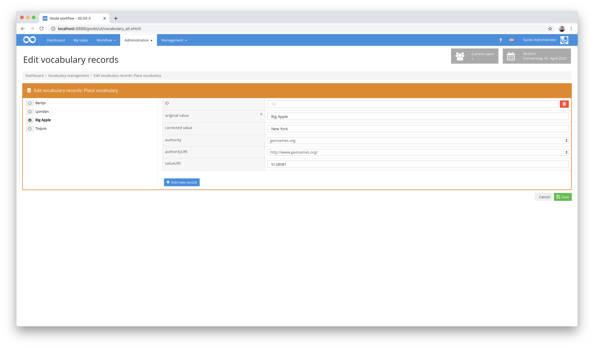
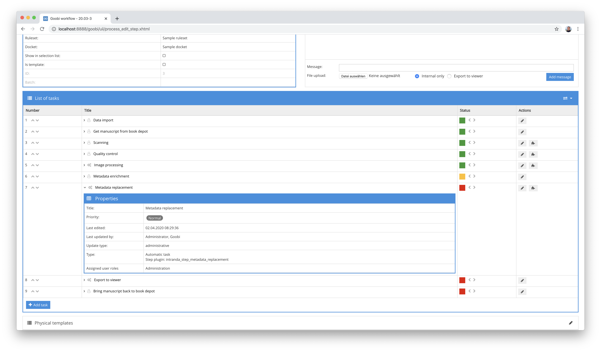

## Introduction
This plug-in allows you to automatically enrich metadata within the METS files of Goobi workflow with content from controlled vocabularies managed within Goobi.Details


## Installation
To use the plugin, it must be copied to the following location:

```bash
/opt/digiverso/goobi/plugins/step/plugin_intranda_step_metadata_replacement-base.jar
```

The configuration of the plugin takes place within its configuration file `intranda_step_metadata_replacement.xml`. This file is expected to be located under the following path:

```bash
/opt/digiverso/goobi/config/intranda_step_metadata_replacement.xml
```

## Overview and functionality
This plugin can be configured in a very granular way and works closely with the vocabularies managed within Goobi. The following example is a good way of demonstrating how it works:

Within the metadata, there is little information about publication locations. Inconsistent spellings of place names and missing links to a standards database mean that information is missing and do not permit the use of linked open data. As an example, the metadata for the place of publication `London` could look as follows:


Within a vocabulary you can maintain locations with associated data. Among other things, you can specify which place names are to be replaced by which place names. In addition, you can define here which link to a standards database such as `GeoNames` or `VIAF` should be created.



Within the Goobi workflow, the metadata available within the METS file of a Goobi process can be automatically enriched with data from the vocabulary based on a configuration as described above. In the case of London, for example, the desired spelling can be transferred to an additional field together with the standards data from `GeoNames`.


The constant maintenance of vocabulary and the ability to integrate into a workflow, even at several points within tasks, means that content can be updated and published in the future.


## Configuration
The configuration of the plugin is structured as follows:

```xml
<config_plugin>
    <config>
        <project>*</project>
        <step>*</step>
        <entry>

            <!-- from which field inside of the METS file shall the content be used -->
            <fieldFrom>originalAccessLocations</fieldFrom>

            <!-- into which fields in the METS shall the new content be written -->
            <fieldTo>AccessLocations</fieldTo>

            <!-- if the fieldTo is named inside of the vocabulary entry itself: in
                which vocabulary field of the entry is the METS metadata name defined to
                be used? Please notice: if the entry cannot be found (as fieldFrom is not
                found there) and that's why no fieldToDynamic can be read from the entry
                the value of element fieldTo defined will be used to simply copy the original
                metadata unchanged -->
            <fieldToDynamic>type</fieldToDynamic>

            <!-- what is the name of the vocabulary to use -->
            <vocabulary>Subject terms</vocabulary>

            <!-- the content in which vocabulary field has to be the same as in fieldFrom -->
            <contentSearch>original value</contentSearch>

            <!-- the content in which vocabulary field shall be taken to write it
                into fieldTo -->
            <contentReplace>corrected value</contentReplace>

            <!-- the content in which vocabulary fields shall be taken to fill the
                authority information for the replaced record -->
            <contentAuthority>authority</contentAuthority>
            <contentAuthorityUri>authorityURI</contentAuthorityUri>
            <contentAuthorityValueUri>valueURI</contentAuthorityValueUri>

            <!-- if the content for fieldFrom cannot be found in the vocabulary to be replaced,
                shall the original value be duplicated then? -->
            <duplicateIfMissing>false</duplicateIfMissing>

            <!-- if the same value in fieldTo exists more than once remove the duplicates -->
            <removeDuplicatedFieldTo>false</removeDuplicatedFieldTo>

        </entry>
    </config>
</config_plugin>
```

The parameters within this configuration file have the following meanings:

| Value | Description |
| :--- | :--- |
| `project` | This parameter determines for which project the current block `<config>` is to apply. The name of the project is used here. This parameter can occur several times per `<config>` block. |
| `step` | This parameter controls for which work steps the block &lt;config&gt; should apply. The name of the work step is used here. This parameter can occur several times per `<config>` block. |
| `entry` | Several `entry` blocks for replacement rules can be defined within a configuration block. |
| `fieldFrom` | This parameter determines which metadata for a replacement should be used as the starting field. |
| `fieldTo` | This parameter determines which metadata should be used as the target field for a replacement. |
| `fieldDynamic` | If the target field should also be taken from the vocabulary record, the field within the vocabulary can be specified here. |
| `vocabulary` | Enter the name of the vocabulary in Goobi workflow here. |
| `contentSearch` | Here you define which field of the vocabulary is to be used to search for the value from the source field. |
| `contentReplace` | Define here which field of the vocabulary should be used to replace the value from the source field. |
| `contentAuthority` | If standard data are to be transferred, the field within the vocabulary for the authority can be defined here. |
| `contentAuthorityUri` | If standard data are to be transferred, the field within the vocabulary for the Authority URI can be defined here. |
| `contentAuthorityValueUri` | If standard data are to be transferred, the field within the vocabulary for the data record can be defined here. |
| `duplicateIfMissing` | If the original value is to be used if no match is found within the vocabulary, this value must be set to `true`. |
| `removeDuplicatedFieldTo` | If a target field with the same content exists several times, this parameter can be used to specify that duplicates are to be removed. Only the field type and value are checked. Persons, corporate bodies, metadata groups and authority information are not taken into account. |

To put the plugin into operation, it must be activated for one or more desired tasks in the workflow. This is done as shown in the following screenshot by selecting the `intranda_step_metadata_replacement` plugin from the list of installed plugins.


